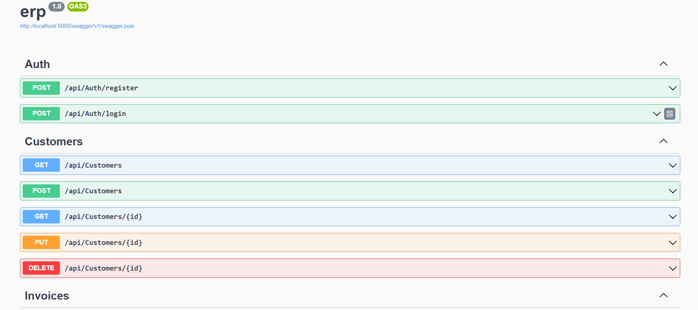
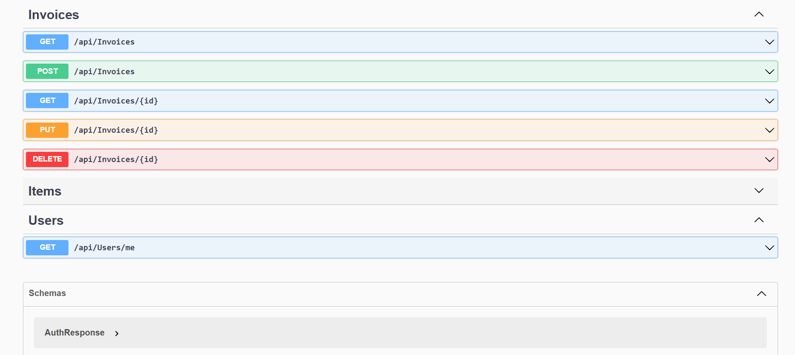

# Mini ERP System

**ASP.NET Core Web API + MySQL + React**

A full-stack Mini ERP system built to demonstrate real-world enterprise application concepts such as authentication, inventory management, and sales invoicing.

---

## Key Features

- JWT-based Authentication (Register & Login)
- Secure user profile endpoint
- Inventory (Items) Management
- Sales Invoicing with line items
- Automatic stock reduction on invoicing
- RESTful APIs documented using Swagger

---

## Tools & Technologies

### Backend
- ASP.NET Core Web API (.NET 9)
- C#
- MySQL
- JWT Authentication
- Swagger (OpenAPI)
- MySqlConnector

### Frontend
- React
- JavaScript
- Axios
- React Router

### Development Tools
- Visual Studio Code
- .NET CLI
- Node.js & npm
- Git

---

## Project Folder Structure

```text
erpdotnet/
├── MiniErp.Api/
│   ├── Controllers/
│   │   ├── AuthController.cs
│   │   ├── UsersController.cs
│   │   ├── ItemsController.cs
│   │   └── InvoicesController.cs
│   │
│   ├── Models/
│   │   ├── AuthDtos.cs
│   │   ├── ItemDtos.cs
│   │   └── InvoiceDtos.cs
│   │
│   ├── Properties/
│   │   └── launchSettings.json
│   │
│   ├── Program.cs
│   ├── appsettings.json
│   └── MiniErp.Api.csproj
│
├── mini-erp-ui/
│   ├── src/
│   │   ├── api.js
│   │   ├── App.js
│   │   ├── Login.js
│   │   ├── Register.js
│   │   ├── Me.js
│   │   └── index.js
│   │
│   ├── assets/
│   │   ├── ss1.jpg   (Swagger API overview)
│   │   └── ss2.jpg   (Swagger JWT authorization)
│   │
│   └── package.json
│
└── README.md
Database Setup (MySQL)
Run the following SQL scripts:

CREATE DATABASE mini_erp;
USE mini_erp;

CREATE TABLE erp_users (
  id INT AUTO_INCREMENT PRIMARY KEY,
  email VARCHAR(200) NOT NULL UNIQUE,
  password_hash VARCHAR(255) NOT NULL,
  password_salt VARCHAR(255) NOT NULL,
  full_name VARCHAR(200),
  role VARCHAR(50) DEFAULT 'Clerk',
  created_at TIMESTAMP DEFAULT CURRENT_TIMESTAMP
);

CREATE TABLE items (
  id INT AUTO_INCREMENT PRIMARY KEY,
  sku VARCHAR(50) NOT NULL UNIQUE,
  name VARCHAR(200) NOT NULL,
  unit_price DECIMAL(10,2) NOT NULL,
  qty_on_hand INT NOT NULL,
  is_active TINYINT(1) DEFAULT 1,
  created_at TIMESTAMP DEFAULT CURRENT_TIMESTAMP
);

CREATE TABLE sales_invoices (
  id INT AUTO_INCREMENT PRIMARY KEY,
  invoice_no VARCHAR(30) NOT NULL UNIQUE,
  customer_name VARCHAR(200) NOT NULL,
  invoice_date DATE NOT NULL,
  total DECIMAL(12,2) NOT NULL,
  created_by_email VARCHAR(200),
  created_at TIMESTAMP DEFAULT CURRENT_TIMESTAMP
);

CREATE TABLE sales_invoice_lines (
  id INT AUTO_INCREMENT PRIMARY KEY,
  invoice_id INT NOT NULL,
  item_id INT NOT NULL,
  qty INT NOT NULL,
  unit_price DECIMAL(10,2) NOT NULL,
  line_total DECIMAL(12,2) NOT NULL,
  FOREIGN KEY (invoice_id) REFERENCES sales_invoices(id) ON DELETE CASCADE,
  FOREIGN KEY (item_id) REFERENCES items(id)
);
Backend Configuration
Edit MiniErp.Api/appsettings.json:

{
  "ConnectionStrings": {
    "MySql": "Server=localhost;Port=3306;Database=mini_erp;User=root;Password=YOUR_PASSWORD;"
  },
  "Jwt": {
    "Key": "CHANGE_THIS_TO_A_LONG_RANDOM_SECRET_KEY",
    "Issuer": "MiniErp",
    "Audience": "MiniErpClient",
    "ExpiresMinutes": 60
  }
}
How to Run the Project
Run Backend (ASP.NET Core)
cd MiniErp.Api
dotnet run
API URL: http://localhost:5000

Swagger UI: http://localhost:5000/swagger

Run Frontend (React)
cd mini-erp-ui
npm install
npm start
Frontend URL: http://localhost:3000

API Testing with Swagger
Open Swagger UI:

http://localhost:5000/swagger
Swagger Screenshots



Swagger API Overview


JWT Authorization in Swagger


Authentication Flow
Call POST /api/auth/register or POST /api/auth/login

Copy the returned JWT token

Click Authorize in Swagger

Paste:

Bearer <JWT_TOKEN>
Access protected endpoints

Available API Endpoints
Authentication
POST /api/auth/register

POST /api/auth/login

User
GET /api/users/me (Protected)

Items (Inventory)
GET /api/items

POST /api/items

PUT /api/items/{id}

DELETE /api/items/{id}

Invoices
POST /api/invoices

GET /api/invoices/{id}

ERP Workflow Summary
User registers or logs in

Inventory items are created

Sales invoice is generated

Stock quantity is reduced automatically

Invoice total is calculated

Future Enhancements
Customers and suppliers module

Purchase orders

Invoice listing and search

Role-based authorization (Admin / Clerk)

Reports and dashboards

Author
Mini ERP System
Built using ASP.NET Core, MySQL, and React
Developed for academic and internship evaluation purposes